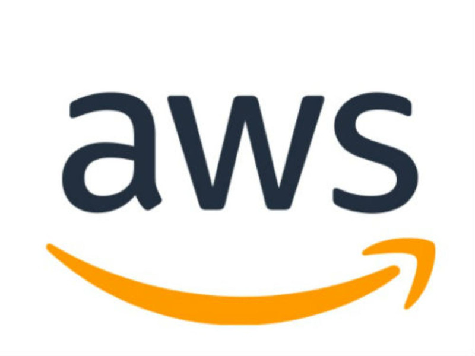
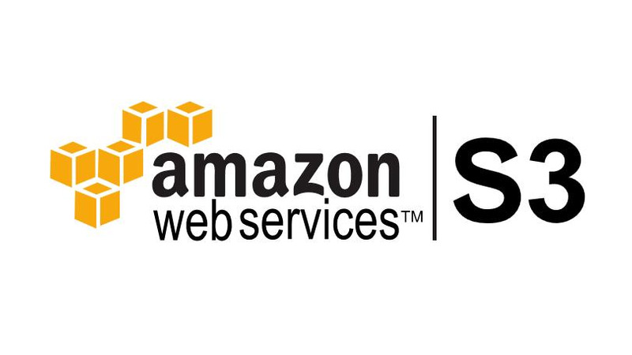
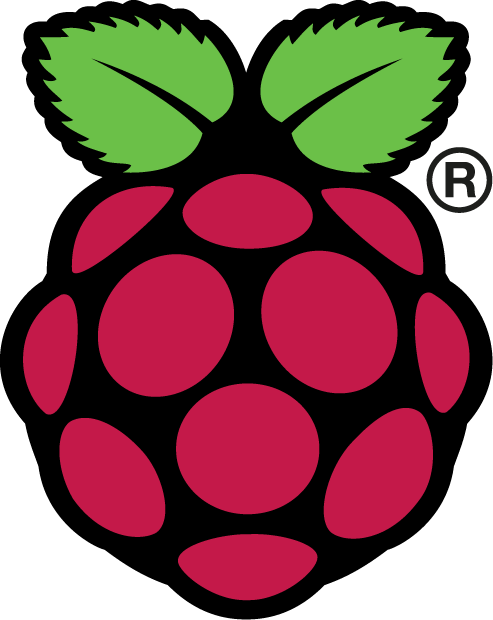
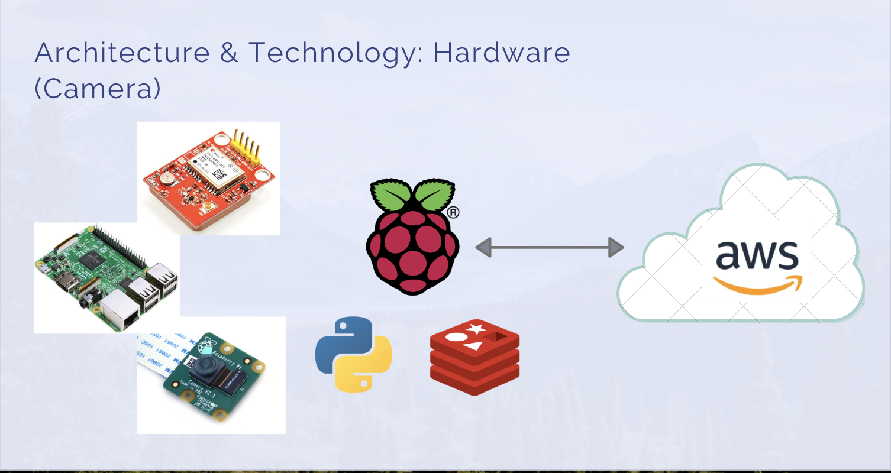

<div align="center">
    
</div>
<h1 align="center" >SOJOURNAL</h1>

## Remember your sojourns.

<div height="400px" width="800px">
    <h1 align="center">
    
    </h1>
</div>
<div align="center">
    <div >
        ***********************************************************************
        <br/>
        <a href="https://sojournal.wixsite.com/sojournal">Our landing page</a>
        <br/>
        <br/>
        App available at Google Play
        <br/>
        <a href="https://play.google.com/store/apps/details?id=com.codechrysalis.magellansmiles">
        
        </a>
        <br/>
        ***********************************************************************
    </div>
</div>
<div align="center">

[Overview](#1-overview)&nbsp;&nbsp;&nbsp; |&nbsp;&nbsp;&nbsp;
[Technology](#2-technology)&nbsp;&nbsp;&nbsp; |&nbsp;&nbsp;&nbsp;
[Architecture](#3-architecture)&nbsp;&nbsp;&nbsp;|&nbsp;&nbsp;&nbsp;
[Features](#4-features)&nbsp;&nbsp;&nbsp;|&nbsp;&nbsp;&nbsp;[Setup](#5-setup)&nbsp;&nbsp;&nbsp;|&nbsp;&nbsp;&nbsp;[Deployment](#4-deployment)&nbsp;&nbsp;&nbsp;|&nbsp;&nbsp;&nbsp;[Contributions](#5-contributions)

</div>

---

## 1. Overview

Trip Log™ is a cloud image storage based on geographic location. Though Trip Log is aimed to expand creativity of our users through automatic mapping of photos and user friendly text editing interface, with Trip Cam, it can be expanded infinately more.Trip Log™ respects the privacy of our users. Although our users can share their stories via integrated image export or url, user decides if it is partially shared or the whole.

## 2. Technology

### Frontend

<div width="300px">


</div>

### Backend

<div width="400px">




</div>

### Hardware

<div width="300px">



</div>

## 3. Architecture

### Frontend

### Backend

### Hardware



## 4. Features

### a) _Upload Photos That Automatically Locates on Map_

Once you open the app, you will see your geographical location zoomed into google map.

Click on the **Upload** button and it will direct you to your image gallery on your mobile device. Select one or multiple images to upload.

Once photos are chosen, you will be able to see it on the map. Please refer to the instruction below to learn more about writting comments for each photo uploads.

### b) _Check out the name of a truck stop_

If you click a marker, an informational pop-up balloon with the name of that truck stop will appear just above the marker.

To close a pop-up balloon, click the marker or the close button (marked with an 'x') in the upper-right hand corner of the balloon.

## 5. Setup

### Frontend

1. Clone our repositry from GitHub

```
$ git clone https://github.com/sojournalists/sojournal.git
```

2. Install and set up [Android Studio](https://developer.android.com/studio)

3. Install dependencies

```
$ yarn install
```

4. Run Android emulator from Android Studio

5. Start Application

```
$ yarn android
```

### Backend

1. Clone our repositry from GitHub

```
$ git clone https://github.com/sojournalists/sojournal.git
```

2. Install dependencies

```
$ yarn install
```

3. Setup the Database

```
#Create database
$ createdb triplog

#Drop database
$ dropdb triplog

#Migration
$ yarn knex --knexfile=./db/knexfile.js migrate:latest

#Rollback
$ yarn knex --knexfile=./db/knexfile.js migrate:rollback

#Seed data
yarn knex --knexfile=./db/knexfile.js seed:run
```

3. Run Server

```
$ yarn node db/server.js
```

4. Run Server (Development)

```
$ yarn nodemon db/server.js
```

5. Now you can test server at localhost:4000/graphql

### Hardware

See Hardware [README](./raspberry-pi/README.md)

## 6. Contributions

To contribute to this app, make sure you create a branch and **ALWAYS** make a pull request. **DO NOT EDIT THE MASTER!**

`git checkout -b <branch_name>`

If you want to push your edited files to your remote file, run the following:

`git push <remote_name> <branch_name>`

---

<div align="center">
<b>LICENSE</b>: CC7 TEAM CYAN
</div>
<br/>
<div align="center">
<b>Linkedin</b>: <br/>

[Brian Lee](https://www.linkedin.com/in/briansunghaklee/)&nbsp;&nbsp;&nbsp; |&nbsp;&nbsp;&nbsp;[Omar Kalouti](https://www.linkedin.com/in/omar-kalouti/)&nbsp;&nbsp;&nbsp;|&nbsp;&nbsp;&nbsp;[Chaz Wilson](https://www.linkedin.com/in/chaz-wilson/)&nbsp;&nbsp;&nbsp;|&nbsp;&nbsp;&nbsp;[Keisuke Mori](https://www.linkedin.com/in/keisuke-mori/)
