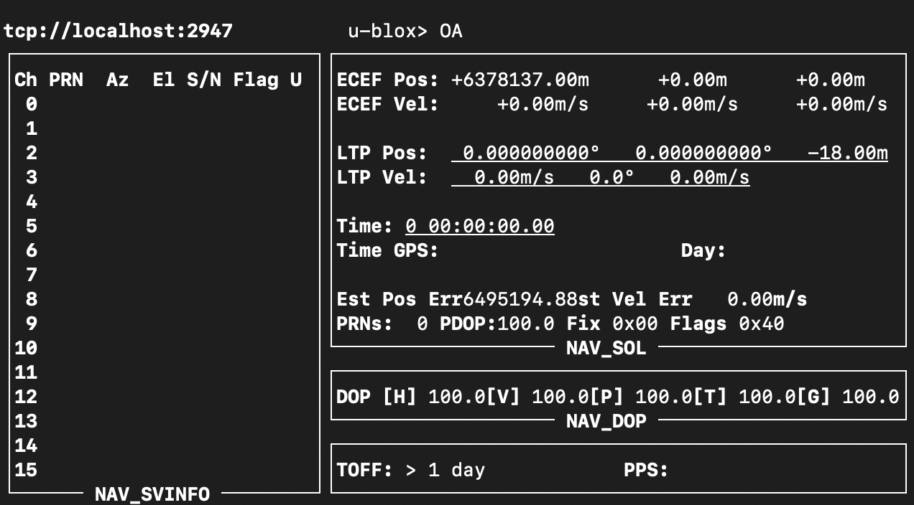

# Sojournal - Hardware

## Hardware Recipe

- [Raspberry Pi 3 model b+](https://www.raspberrypi.org/products/raspberry-pi-3-model-b-plus/)
- Micro SD Card 32GB
- Micro USB Charger
- [GPS Module](https://www.amazon.co.jp/gp/product/B07D7373KN/)
- [Raspberry Pi Camera Module v2](https://www.raspberrypi.org/products/camera-module-v2/)

## Install Raspbian OS

- Use NOOBS – New Out Of the Box Software  
  [NOOBS](https://www.raspberrypi.org/downloads/noobs/) - Offline and network install  
  [NOOBS Lite](https://www.raspberrypi.org/downloads/noobs/) - Network install
- [Setting up guide](https://projects.raspberrypi.org/en/projects/raspberry-pi-setting-up)

## Connect to Rapberry Pi using ssh

From GUI

1. Connect HDMI cable and display it to the monitor
2. Setting up of Wifi
3. Open the terminal in your machine and connect your Pi by ssh

```
$ ssh pi@raspberrypi.local
```

4. Enter your pi's password and login to Pi

From CUI

1. Connect Erthnet cable your Pi and your machine
2. Open the terminal and check the IP address of your Pi

```
$ arp -a
```

3. Connect to your Pi by ssh

```
$ ssh pi@"your pi's IP address"
```

## Setting up Python

- Python 2.7 (already installed)

## Setting up GPS module

1. Change the Rapsberry Pi config

   1. Open the Pi config

   ```
   $ sudo raspi-config
   ```

   2. Select 'Interfacing Option'
   3. Activate 'P6 Serial'
   4. Exit

1. Install Linux library
   1. Install gpsd gpsd-clients python-gps
   ```
   $ sudo apt-get install gpsd gpsd-clients python-gps
   ```
   2. Change the boot file
   ```
   $ sudo nano /boot/cmdline.txt
   ```
   3. Remove the following description
   ```
   console=serial0,115200
   ```
1. Change the config of gpsd

   1. Open the setting file

   ```
   $ nano /etc/default/gpsd
   ```

   2. Modify the file and save it

   ```
   # Default settings for the gpsd init script and the hotplug wrapper.
   # Start the gpsd daemon automatically at boot time
   START_DAEMON="true"
   # Use USB hotplugging to add new USB devices automatically to the daemon
   USBAUTO="false"
   # Devices gpsd should collect to at boot time.
   # They need to be read/writeable, either by user gpsd or the group dialout.
   DEVICES=""
   # Other options you want to pass to gpsd
   GPSD_OPTIONS="/dev/serial0"
   GPSD_SOCKET="/var/run/gpsd.sock"
   ```

   3. Reboot Pi

   ```
   $ sudo reboot
   ```

   4. Check the GPS module working

   ```
   $ gpsmon
   ```

1. Connect GPS module to Pi

   GPIO Map

   | Raspberry Pi | GPS Module |
   | ------------ | ---------- |
   | 3.3V         | VCC        |
   | GND          | GND        |
   | GPIO15 (RXD) | TXD        |
   | GPIO14 (TXD) | RXD        |

   Raspberry Pi GPIO  
   

1. If you can see the following screen, GPS module is working
   

## Setting up Camera module

- [Getting started with pi camera](https://projects.raspberrypi.org/en/projects/getting-started-with-picamera)

## Download source code

1. In Raspberry Pi home ("/home/pi"), Clone the source code from repository

```
$ git clone https://github.com/sojournalists/sojournal.git
```

2. Go to "/home/pi/scripts" directory

   | Script          |                                                  |
   | --------------- | ------------------------------------------------ |
   | led.py          | Manipulate the PWD, ACT LED                      |
   | serial.py       | Get the Rapberry Pi serial number                |
   | loggingGPS.py   | Get the GPS data and send it to server           |
   | takePhoto.py    | Taking photo                                     |
   | takePhotoGPS.py | Taking photo and send it to server with GPS data |

## Setting up to server url

1. Edit "/etc/profile" as super user

```
$ sudo nano "/etc/profile"
```

2. Add the following environmental variables to bottom of the file

```
export URL_LOCAL=http://"Your local server's address":4000/graphql
export URL_PROD=http://"Your production server's address":4000/graphql
export DISPLAY=:0
```

## Running Script

1. Go to "/home/pi/scripts/" folder

- Record the GPS data

```
$ python loggingGPS.py
```

- Record Photo

```
$ python takePhoto.py
```

- Record Photo with GPS data

```
$ python takePhotoGPS.py
```

## Setting up of start up scripts

1. Go to "~/.config/autostart" directry
2. Create/Edit the photo.desktop file

```
$ nano photo.desktop
```

```
[Desktop Entry]
Type=Application
Name=Photo
Exec=python /home/pi/scripts/takePhoto.py
```

3. Create/Edit the gps.desktop file

```
$ nano gps.desktop
```

```
[Desktop Entry]
Type=Application
Name=GPS
Exec=python /home/pi/scripts/loggingGPS.py
```

4. If you want to stop the init scripts temporary, please add "NotShowIn=LXDE" to the end of desktop file

```
[Desktop Entry]
Type=Application
Name=Photo
Exec=python /home/pi/scripts/takePhoto.py
NotShowIn=LXDE
```

## Logging

1. Log File

| Location                             |                                   |
| ------------------------------------ | --------------------------------- |
| /home/pi/scripts/logs/loggingGPS.log | Log of the GPS logging            |
| /home/pi/scripts/logs/takePhoto.log  | Log of Photo taking               |
| /home/pi/scripts/logs/takePhoto.log  | Log of Photo taking with GPS data |

2. Log Level, Log Rotation

- [Log Level](https://docs.python.org/2/library/logging.html#logging-levels)

- [Log Rotation](https://docs.python.org/2/library/logging.handlers.html#timedrotatingfilehandler)

- Example
  ```
  # logging
  basicConfig(level=DEBUG)
  logger = getLogger(__name__)
  handler = handlers.TimedRotatingFileHandler(
      filename='/home/pi/scripts/logs/takePhoto.log',
      when='D'
  )
  logger.addHandler(handler)
  ```
